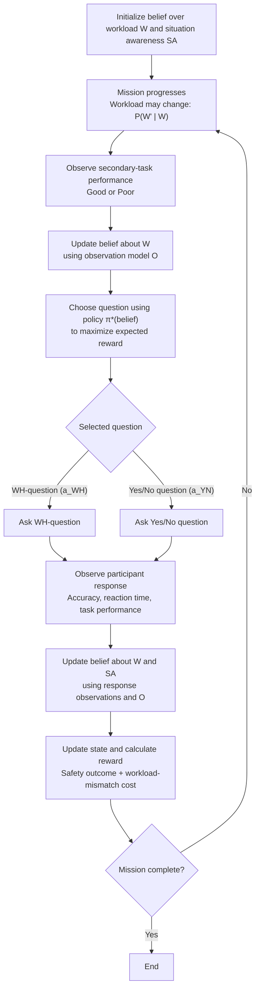

# Adaptive Workload POMDP Flow Chart

```mermaid
flowchart TD
    A["Initialize belief over workload W and situation awareness SA"] --> B["Mission progresses<br/>Workload may change: P(W' | W)"]
    B --> C["Observe secondary-task performance<br/>Good or Poor"]
    C --> D["Update belief about W<br/>using observation model O"]
    D --> E["Choose question using policy π*(belief)<br/>to maximize expected reward"]
    E --> F{"Selected question"}
    F -- "WH-question (a_WH)" --> G["Ask WH-question"]
    F -- "Yes/No question (a_YN)" --> H["Ask Yes/No question"]
    G --> I["Observe participant response<br/>Accuracy, reaction time, task performance"]
    H --> I
    I --> J["Update belief about W and SA<br/>using response observations and O"]
    J --> K["Update state and calculate reward<br/>Safety outcome + workload-mismatch cost"]
    K --> L{"Mission complete?"}
    L -- No --> B
    L -- Yes --> M["End"]
```
